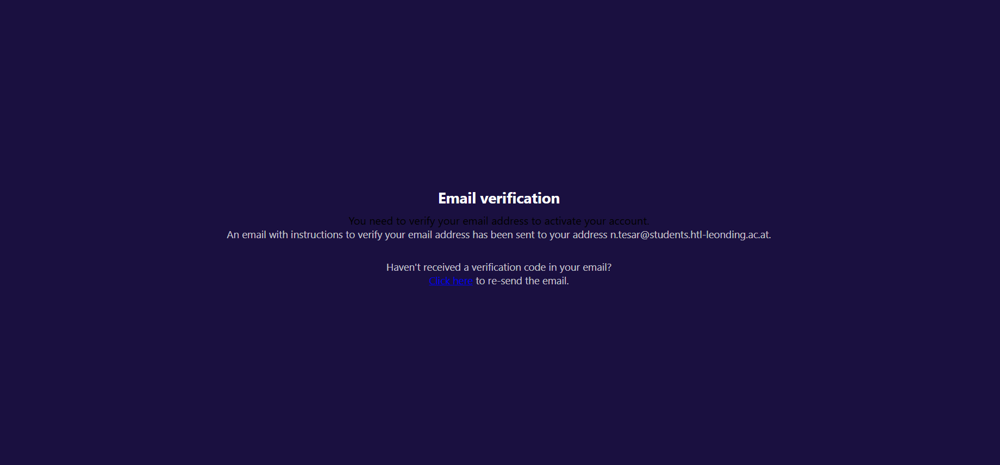
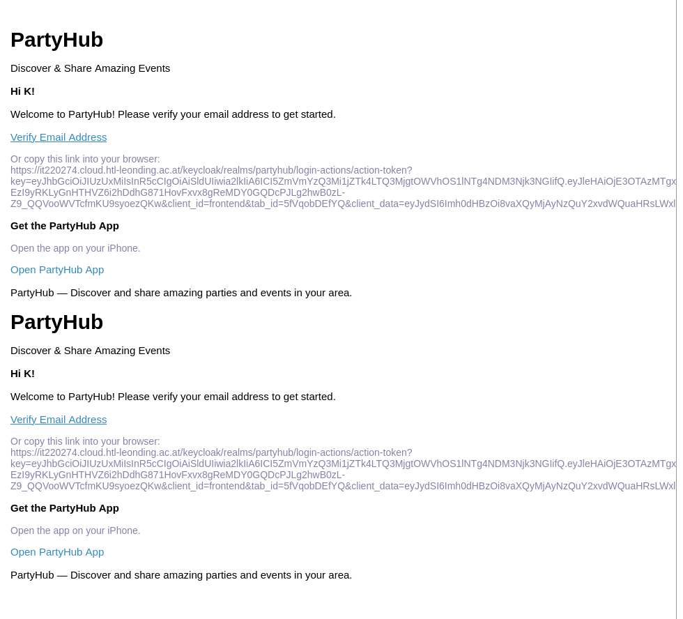

# Fehlersuche auf der Seite von Partyfinder

## High Risk
* Sobald auf eine Party gecklickt wird, kommt man zu einem anmeldefenster. Wenn man jedoch einen Schritt zurückgeht, wird die Party ohne Anmeldung angezeigt.

<video width="320" height="240" controls>
  <source src="./vid/fehler1.mp4" type="video/mp4">
</video>

* Sobald auf einen Account gecklickt wird, kommt man zu einem anmeldefenster. Wenn man jedoch einen Schritt zurückgeht, wird die Party ohne Anmeldung angezeigt.

<video width="320" height="240" controls>
  <source src="./vid/fehler2.mp4" type="video/mp4">
</video>

* Sobald auf Notifications gecklickt wird, kommt man zu einem anmeldefenster. Wenn man jedoch einen Schritt zurückgeht, wird die Party ohne Anmeldung angezeigt.

<video width="320" height="240" controls>
  <source src="./vid/fehler3.mp4" type="video/mp4">
</video>

## Medium Risk

* Wenn man sich auf einem Handy anmelden will, hat man das Problem, dass das Login-OVerlay viel zu klein ist. 

* Wenn man einen zweiten Tab öffnet, kommt es zu einen Loginfehler. 

<video width="320" height="240" controls>
  <source src="./vid/fehler4.mp4" type="video/mp4">
</video>

## Low Risk

* Sobald eine Party vergangen ist, wird sie trotzdem angezeigt

 

* Wenn man auf das Fenster zur E-Mail verifycation kommt, dann wird der Text "You need to verify your email address to activate your account." in schwarzer Farbe auf lila Hintergrund angezeigt.

>Contrast Guidlines nicht eingehalten!

* Beim registrieren wird die Nachricht doppelt gesendet

