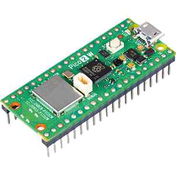
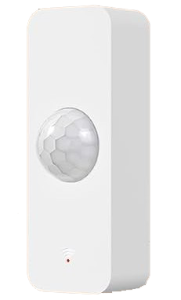
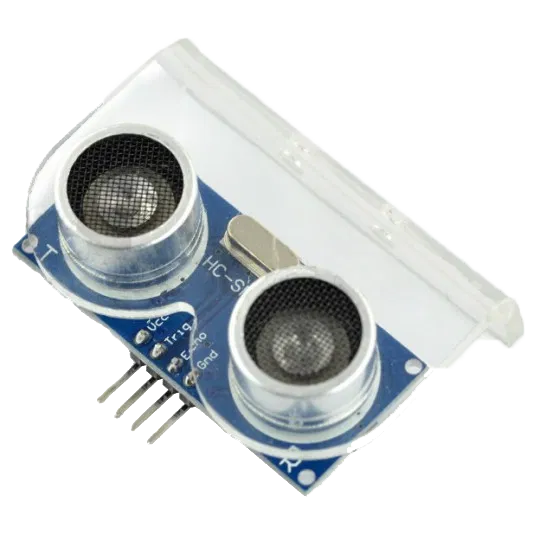
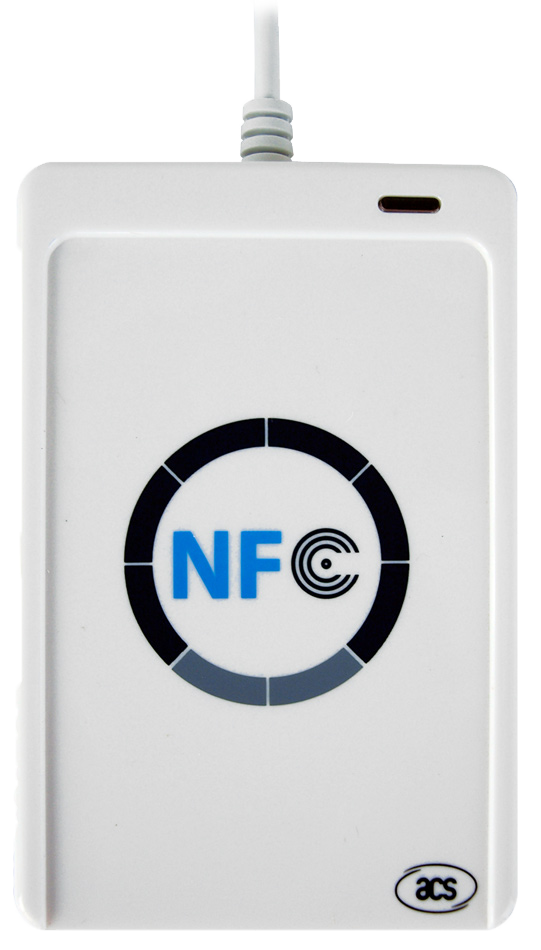

# Sensorbasierte Platzbelegung

---

## 1. Raspberry Pi Pico 2 WH

[Produktlink bei Reichelt](https://www.reichelt.at/at/de/shop/produkt/raspberry_pi_pico_2_wh_rp235x_cortex-m33_wifi_microusb-398576)  
**Preis:** 9 €

### Beschreibung
Der **Raspberry Pi Pico 2 WH** wertet **Sensoren, Knöpfe und NFC-Daten** aus und sendet diese an das **Backend**.

---

### Vorteile
- Flexible **Sensor-Kombinationen** (Ultraschall, Knopf, Bewegung, NFC)  
- Viele **Hardware-Erweiterungen** verfügbar  
- Ideal für **schnelle Prototypen**  
- **Eigene Datenübertragung**, keine Fremd-APIs nötig  
- **Gut dokumentiert** & viele **Tutorials** verfügbar  

---

### Nachteile
- **Preis** summiert sich bei vielen Einheiten  
- **Zusammenbau** erforderlich → zusätzliche Kosten  
- **Programmierung** des Microcontrollers notwendig  

---

### Sensoren (Beispiele)

#### 🔸 Bewegungssensor (PIR HC-SR501)
- [Reichelt-Link](https://www.reichelt.at/at/de/shop/produkt/raspberry_pi_-_infrarot_bewegungsmelder_pir_hc-sr501-224216)  
- Reichweite: **3 m**  
- Preis: **2,30 €**

#### 🔸 Ultraschallsensor (HC-SR04)
- [Reichelt-Link](https://www.reichelt.at/at/de/shop/produkt/entwicklerboards_-_ultraschall_abstandssensor_hc-sr04-161487)  
- Messbereich: **3–400 cm**  
- Preis: **3,83 €**

#### 🔸 NFC-Modul (MFRC-522)
- [Reichelt-Link](https://www.reichelt.at/at/de/shop/produkt/entwicklerboards_-_rfid-modul_nxp_mfrc-522-192147)  
- Preis: **7 €**

#### 🔸 IR-Lichtschranken (2 × pro Koje)
- **Empfänger:** [IR-Empfänger](https://www.reichelt.at/at/de/shop/produkt/arduino_-_ir-empaenger-282519) → **1,56 €**  
- **Sender:** [IR-Sender](https://www.reichelt.at/at/de/shop/produkt/arduino_-_ir-sendermodul-282523) → **1,61 €**
> Solange die Lichtschranke unterbrochen ist, wird die Koje als **besetzt** markiert.

#### 🔸 Kabel
- Länge: **50cm * 20**
- Preis: **7,16€**

---

## 2. Tuya-Bewegungsmelder

[Amazon-Link](https://www.amazon.de/WiFi-Bewegungssensor-Bewegungsmelder-Heimsicherheit-Fernüberwachungs/dp/B0CLY2H1H6/)  
**Preis:** ca. **50 € (4 Stück)**  

---

### Zugriffsmöglichkeiten

#### 🔸 Lokale WLAN-Steuerung
- Schnellere Reaktion als Cloud-Steuerung  
- Notwendige Daten:  
  - **Device ID**, **Local Key**, **IP-Adresse**, **DP-Codes**  
- Tools: **tinytuya (Python)** kann Geräte im LAN scannen  
- Bewegungen → DP-Code (z. B. `101`) = `true/false`

#### 🔸 Cloud-Steuerung
- Über **Tuya IoT Console** ([iot.tuya.com](https://iot.tuya.com))  
- Geräteverknüpfung per **QR-Code**  
- Zugriff auf **Device ID**, **Local Key**, **DP-Codes**  
- Integration in eigene Software möglich  

---

### Integration mit Quarkus REST API
- Statusabfrage über **Listener (Push)** oder **Polling**  
- **Port:** 6668  
- **Verschlüsselung:** AES-128-ECB  

---

### Technische Daten

| Merkmal | Wert |
|----------|------|
| Typ | Drahtloser Bewegungsmelder |
| Reichweite | 6 m |
| Stromversorgung | Batterie |
| Anzahl / Preis | 4 Stk. ≈ 50 € |
| Technologie | Infrarot, WiFi |
| Laufzeit | Bis zu 6 Monate |
| Stromverbrauch | Niedrig |
| Zusatzfunktion | Batteriestands-Warnung |

---

## 3. Ultraschallsensoren (Alternative Lösung)

<!--  -->

[Botland-Link](https://botland.de/ultraschall-abstandssensoren/5686-ultraschall-abstandssensor-hc-sr04-2-200cm-montagehalterung-5904422308452.html)  
**Preis:** 3 € pro Stück → mind. 2 Sensoren nötig  

---

### Vorteile
- Sehr **günstig**  
- **Einfache Verwendung**  
- Bereits **bekannte Technologie**

### Nachteile
- **Fehlauslösung** möglich (Objekt im Weg)  
- **Unzuverlässig** bei bestimmten Materialien oder Winkeln  
- **Weitere Hardwarekomponenten** nötig  

---

## 4. NFC-Reader (für Platzbelegung)

<!--  -->

### Funktionsprinzip
Beim Platznehmen hält der Schüler sein **Smartphone oder Karte** an den **NFC-Reader**.  
→ Die Koje wird in der Datenbank als **„besetzt“** markiert.  
Beim Verlassen wiederholt er den Vorgang → **„frei“**.

---

### Vorteile
- Sehr **praktisch** – Handy ist immer dabei  
- **Schnelle Anmeldung**

### Nachteile
- **Nicht jedes Handy** unterstützt NFC-HCE  
- **Apple-Geräte** nur eingeschränkt kompatibel  
- **Nur Teil der Nutzer** kann das Feature verwenden  
- Benötigt speziellen **NFC-Reader mit HCE-Unterstützung**

---

### Beispiel: ESP32 + NFC-Modul

#### Komponenten:
- **ESP32 (WLAN & Bluetooth integriert)**  
- **NFC-Modul (z. B. PN532 oder RC522)**  

#### Preisübersicht
| Komponente | Einzelpreis | Menge | Gesamt |
|-------------|-------------|--------|---------|
| ESP32 | 7 € | 5 | 35 € |
| NFC-Modul | 4 € | 5 | 20 € |
| **Gesamt** |  |  | **55 €** |

#### Vorteile
- **WLAN integriert**  
- Kann direkt mit **REST-APIs** kommunizieren  

#### Nachteile
- Kein All-in-One-Gerät (NFC-Modul nötig)  
- **Komplexe Programmierung** (NFC + WLAN)  
- **Stromversorgung** über USB oder Netzteil erforderlich  

---

## Zusammenfassung (Vergleich)

| Komponente | Preis | Vorteile | Nachteile |
|-------------|--------|-----------|------------|
| **Raspberry Pi Pico 2 WH** | 9 € | Erweiterbar, dokumentiert | Aufbau & Programmierung nötig |
| **Tuya-Bewegungsmelder** | 50 € (4 Stk.) | WLAN & Cloud ready | Teilweise Cloud-abhängig |
| **Ultraschallsensoren** | 3 €/Stk. | Günstig & einfach | Fehleranfällig |
| **NFC-Reader (ESP32 + NFC)** | 55 € | Handy-Integration | Nicht alle Geräte kompatibel |

-